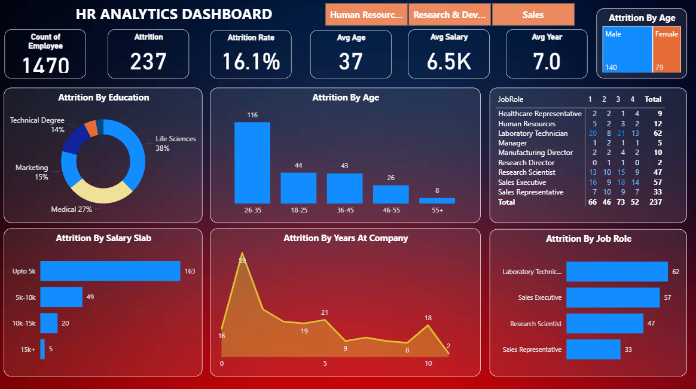

# HR Analytics Dashboard

## 📊 Project Overview

This Power BI project focuses on building an **HR Analytics Dashboard** to analyze employee attrition patterns in an organization. The dashboard helps HR teams and management to identify:

- Overall attrition rate
- Attrition by age group, gender, and education
- Attrition by job role and salary slab
- Insights on average age, salary, and tenure
- Key focus areas for improving retention

---

## 📝 Key Insights

- **Attrition Rate:** 16.1% with 237 employees leaving out of 1470.
- **Highest Attrition Age Group:** 26-35 years.
- **Top Education Groups:** Life Sciences (38%), Medical (27%).
- **Major Attrition by Job Role:** Laboratory Technicians, Sales Executives, Research Scientists.
- **Salary Impact:** Most attrition occurred in employees earning up to 5k.

---

## 💻 Tools Used

- **Power BI Desktop** – For data cleaning, modelling, and dashboard creation.
- **MS Excel / CSV Dataset** – HR employee data analysis.

---

## 📁 Project Files

- **HR Analytics Data.pbix** – Power BI dashboard file.
- **HR_Analytics.csv** – Dataset used in this project.
- **HR_Analytics_Dashboard.png** – Final dashboard image preview.

---

## 🚀 How to Use

1. Clone this repository.
2. Open `HR Analytics Data.pbix` in Power BI Desktop.
3. Explore the dashboard and underlying data model for learning and insights.
4. Use the dataset (`HR_Analytics.csv`) to practise data cleaning and visualisation techniques.

---

## 🎯 Skills Demonstrated

- Data Cleaning and Transformation in Power Query
- Data Modelling and Relationships
- Designing Interactive Dashboards
- Visual and Analytical Storytelling

---

## 📌 Future Scope

- Implement **predictive analytics** to forecast attrition.
- Create **dynamic HR KPIs dashboards** integrated with real-time data.
- Deploy to Power BI Service for organization-wide sharing and scheduled refresh.

---

## 📷 Dashboard Preview

---

## 🤝 Connect

If you like this project or want to discuss data analytics, Power BI, or HR analytics case studies:

- **LinkedIn:** [Your LinkedIn Profile Link Here]
- **GitHub:** [Your GitHub Profile Link Here]

---

> **Note:** This project is part of my ongoing practice to enhance data analytics and BI reporting skills for real-world HR and business scenarios.
