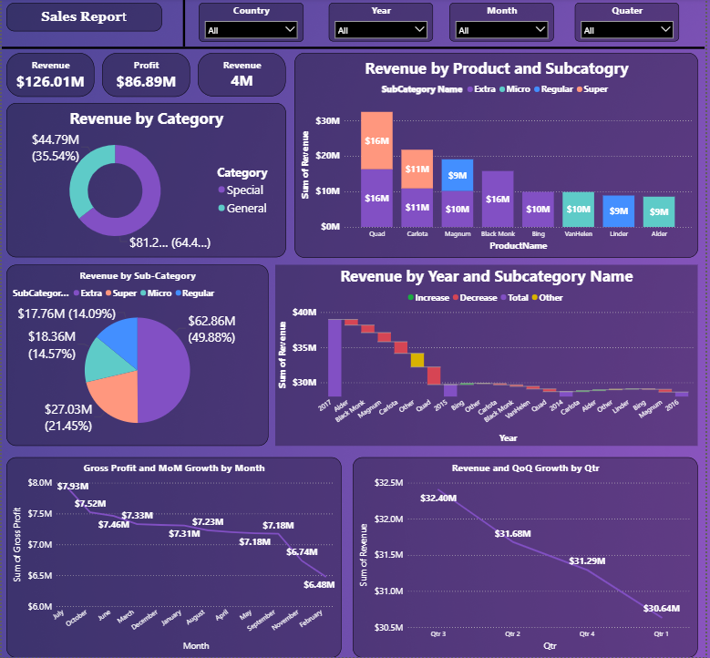

# 📊 Sales Report Dashboard



This repository contains an interactive **Sales Report Dashboard** created in **Power BI** to analyse revenue, profit, category performance, product performance, and time-based trends for strategic business decisions.

---

## 🚀 **Project Overview**

- **Tool Used:** Power BI
- **Dataset:** Embedded sales dataset within the PBIX file
- **Files Included:**
  - `Sales Report.pbix`
  - `Sales-Report-Dashboard.png` (Dashboard Screenshot)

---

### 🔍 **Key Dashboard Insights**

1. **Revenue & Profit Summary**
   - Total Revenue: **$126.01M**
   - Total Profit: **$86.89M**
   - Total Revenue Count: **4M**

2. **Revenue by Category**
   - General: $81.2M (~64.46%)
   - Special: $44.79M (~35.54%)

3. **Revenue by Product and Subcategory**
   - Quad: $32M (Extra & Regular)
   - Other key products: Carlota, Magnum, Black Monk, Bing, VanHalen, Linder, Alder.

4. **Revenue by Sub-Category**
   - Highest: Regular ($62.86M)
   - Others: Extra ($27.03M), Super ($18.36M), Micro ($17.76M)

5. **Revenue by Year and Subcategory**
   - Analyses increasing and decreasing revenue patterns across years and subcategories for strategic insights.

6. **Gross Profit and MoM Growth**
   - Month-on-month gross profit trends to track performance stability.

7. **QoQ Growth**
   - Quarter-on-quarter revenue trends to identify seasonality or declining growth patterns.

---

### 💡 **Key Learnings**

✅ Advanced visualization techniques  
✅ Drill-down and slicer filter panel implementation  
✅ Time-based and category-based trend analysis  
✅ Business storytelling using Power BI visuals

---

### 🛠️ **How to View**

1. Clone this repository:
   ```bash
   git clone https://github.com/<your-username>/sales-report-dashboard.git
